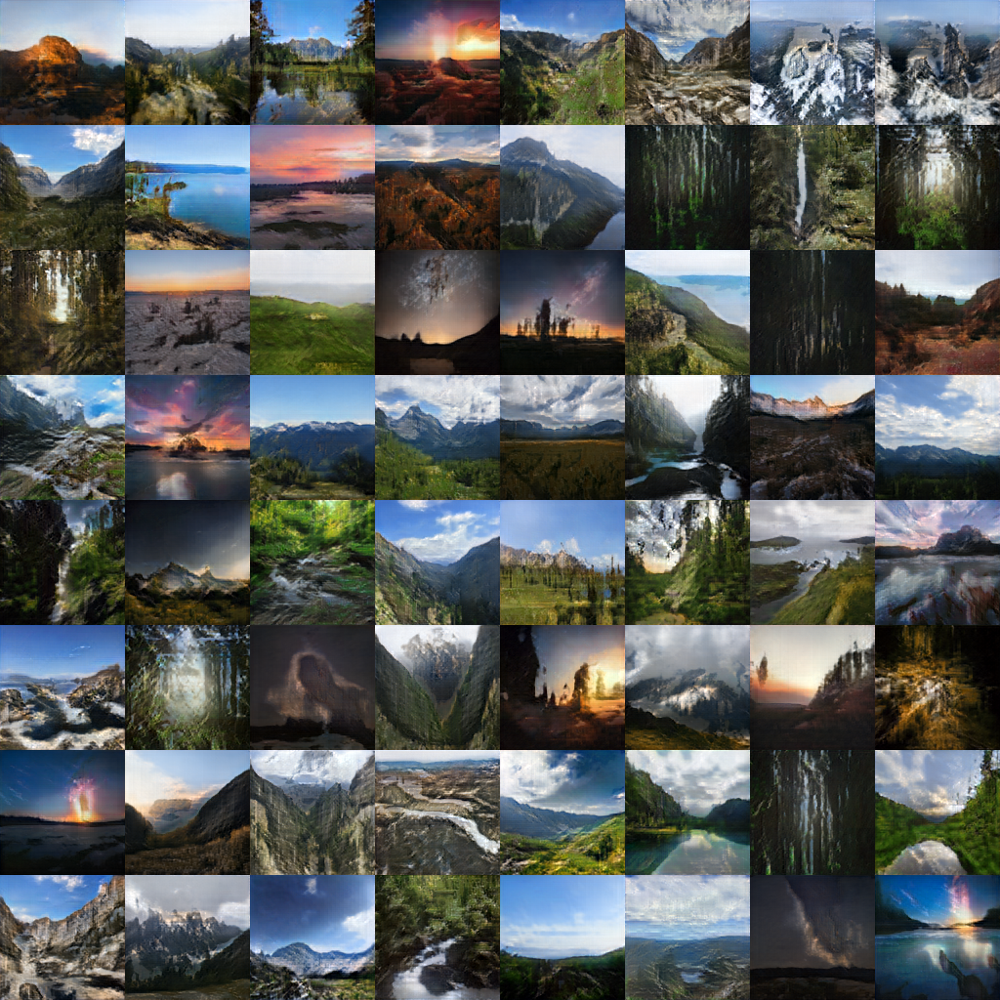
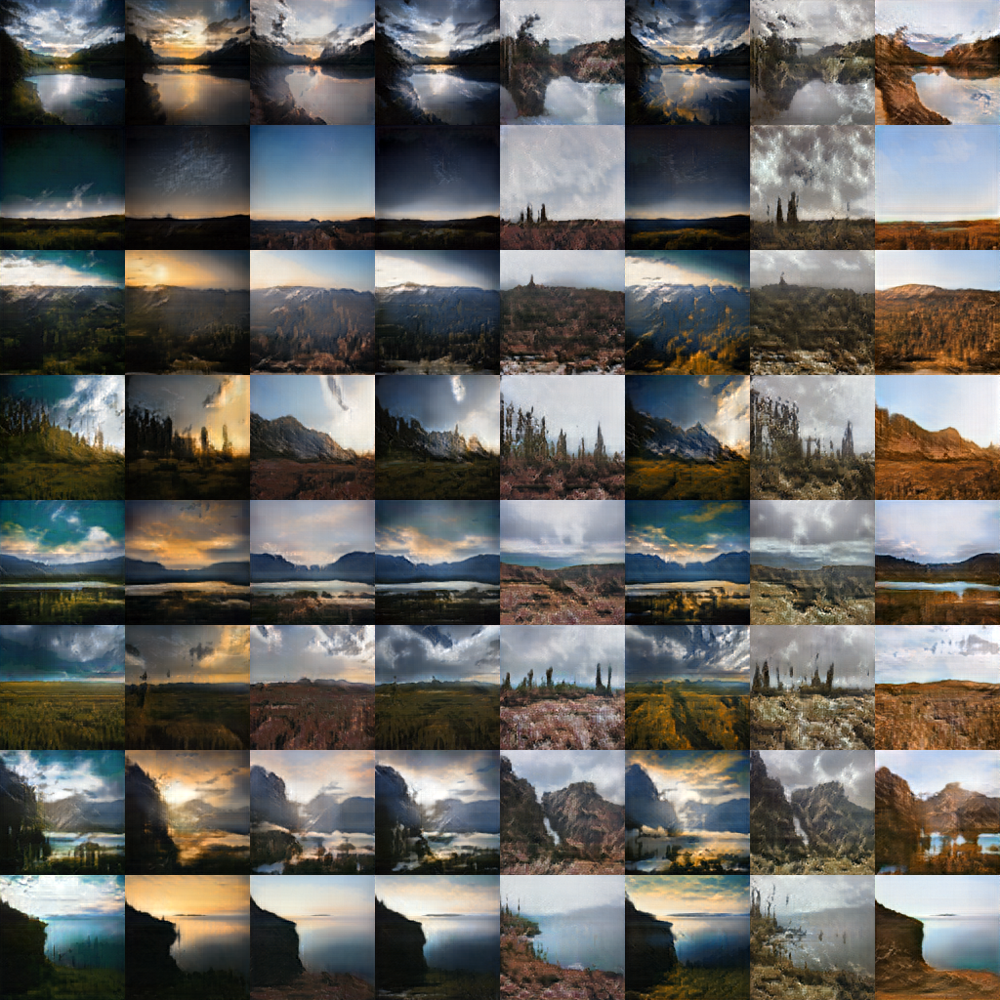

# StyleGAN2 Tensorflow 2.0

Unofficial implementation of StyleGAN 2 using TensorFlow 2.0.

Original paper: Analyzing and Improving the Image Quality of StyleGAN

Arxiv: https://arxiv.org/abs/1912.04958

This implementation includes all improvements from StyleGAN to StyleGAN2, including:

Modulated/Demodulated Convolution, Skip block Generator, ResNet Discriminator, No Growth,

Lazy Regularization, Path Length Regularization, and can include larger networks (by adjusting the cha variable).

## Image Samples
Trained on Landscapes:

Mixing Styles:

## Web Demo
A web demo for generating your own landscapes live:

https://matchue.ca/p/earthhd/

## Before Running
Please ensure you have created the following folders:
1. /Models/
2. /Results/
3. /data/

Additionally, please ensure that your folder with images is in /data/ and changed at the top of stylegan.py.
